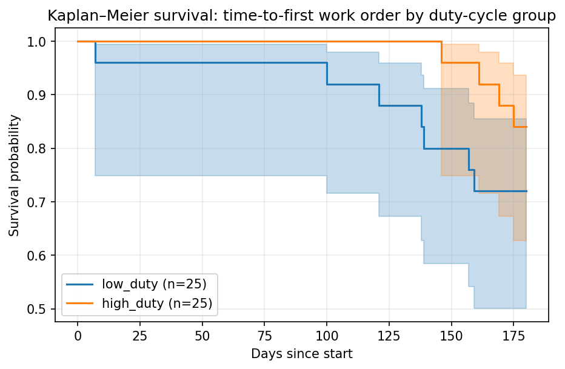
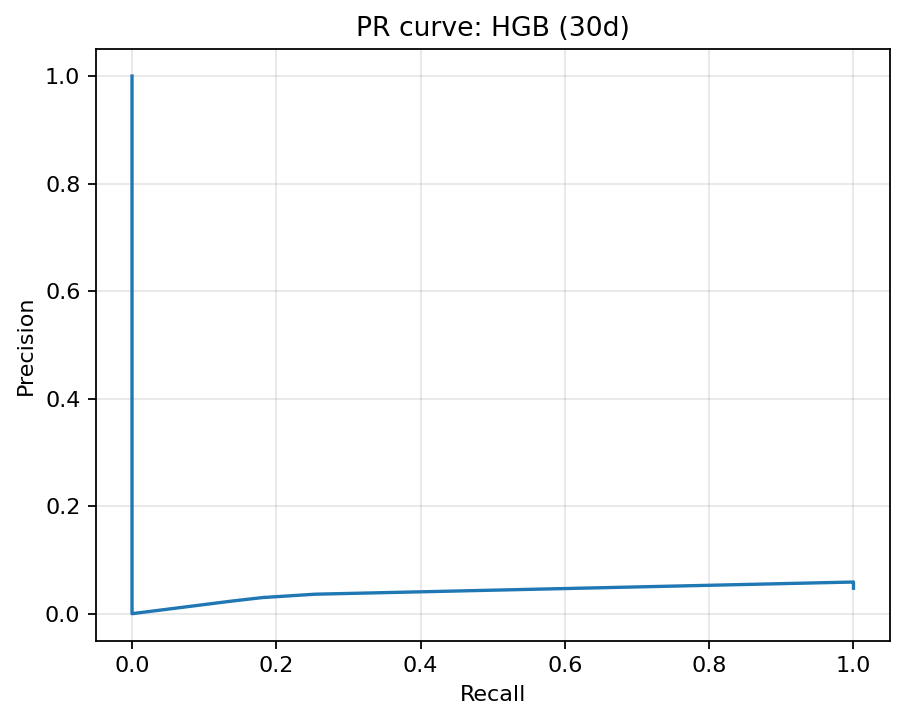
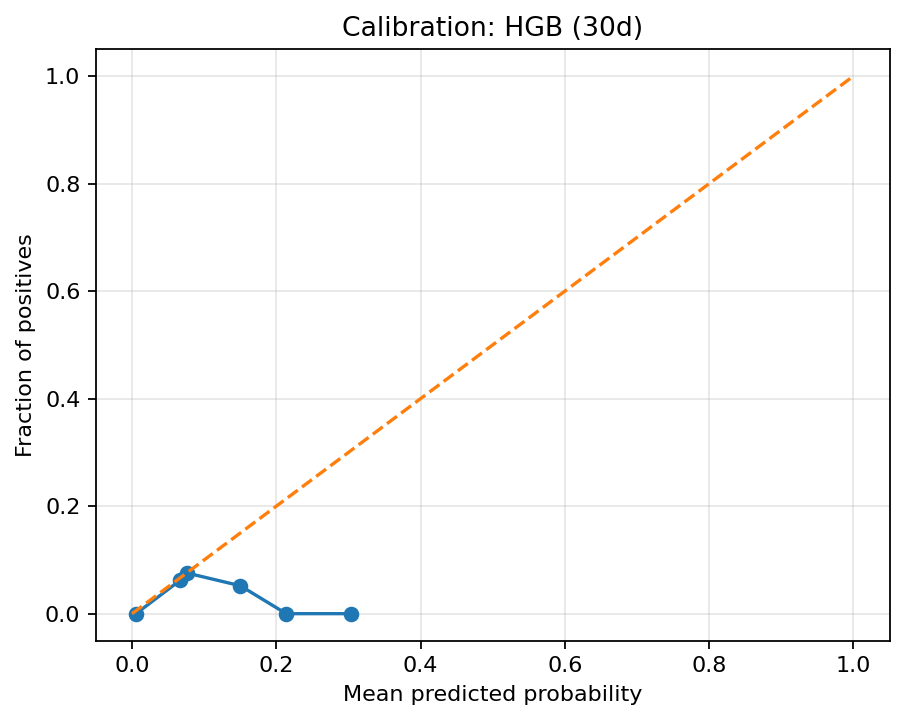
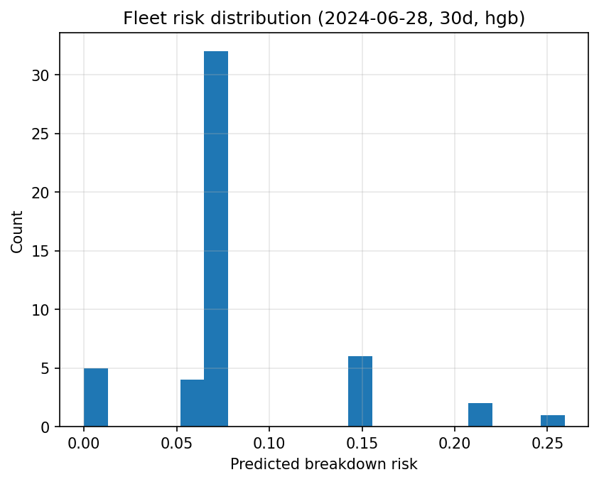
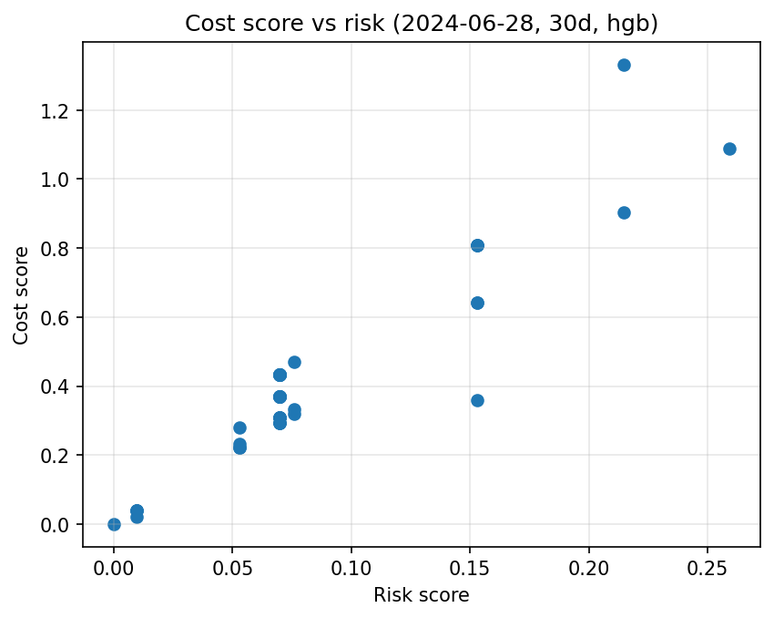

# Fleet Maintenance Triage Agent

[](https://www.python.org/)
[](LICENSE)
[](#tests--quality)

A portfolio-grade, engineer-focused **fleet triage agent** that turns telematics-style signals + DTC events + work orders into an **actionable service queue**:

- **Predictive risk**: calibrated breakdown risk (e.g., **30-day**)
- **Operational decisioning**: **ranked queue** (risk + cost impact)
- **Guardrails**: abstain / manual-review flags (OOD or low confidence)
- **Explainability**: **similar-case retrieval** + interpretable statistics (KM + Cox)
- **Presentation-ready**: auto-generated **PowerPoint deck + PDF**
- **UI**: Streamlit app for triage + evidence drill-down

> This repo runs end-to-end on **synthetic data by default** so anyone can reproduce results quickly.

---

## What you get (sample outputs)

If you committed sample assets to the repo, you can show them here:

- **Sample deck (PDF)**: `docs/assets/auto_deck_sample.pdf`

Example visuals:







---

## Quickstart (Windows / PowerShell)

### 1) Clone + install
```powershell
git clone <YOUR_REPO_URL>
cd fleet-triage-agent
.\scripts\run.ps1 install
```

### 2) Run the full pipeline (recommended)
This runs validation → EDA/stats → training → triage snapshot → latest aliases → deck (+ PDF if available).

```powershell
.\scripts\run.ps1 report
```

**Key outputs**
- `outputs/` (tables, figures, models) — reproducible artifacts
- `report/auto_deck.pptx` and `report/auto_deck.pdf` — shareable results deck

### 3) Launch the Streamlit app
```powershell
.\scripts\run.ps1 app
```

---

## Commands

Run:
```powershell
.\scripts\run.ps1 help
```

Main tasks:

| Task | Command | What it does |
|---|---|---|
| Install | `.\scripts\run.ps1 install` | Create `.venv` and install dependencies |
| Data | `.\scripts\run.ps1 data` | Generate synthetic data |
| Validate | `.\scripts\run.ps1 validate` | Data quality checks (Great Expectations) |
| Train | `.\scripts\run.ps1 train` | Train models + export metrics/plots/models |
| Deck | `.\scripts\run.ps1 deck` | Build `report/auto_deck.pptx` (+ PDF if available) |
| Report | `.\scripts\run.ps1 report` | Full pipeline end-to-end |
| App | `.\scripts\run.ps1 app` | Run Streamlit GUI |
| Test | `.\scripts\run.ps1 test` | Run pytest |
| Lint | `.\scripts\run.ps1 lint` | Ruff lint |

---

## Project structure

- `src/` — pipeline code (data → stats → modeling → retrieval → reporting)
- `app/` — Streamlit UI
- `scripts/` — PowerShell task runner
- `outputs/` — generated artifacts (recommended: **git-ignored**)
- `report/` — generated deck (PPTX + optional PDF)
- `docs/assets/` — **committed** sample images/deck for GitHub preview

---

## Reproducible artifacts (what gets exported)

The pipeline intentionally writes “LaTeX/Deck-ready” assets to stable locations.

Common artifacts:
- Figures: `outputs/figures/*.png` (plus PDFs for LaTeX where applicable)
- Tables: `outputs/tables/*.csv` (plus `.tex` where applicable)
- Models: `outputs/models/*.joblib`
- Triage snapshot: tables/figures + summary JSON + stable `*_latest.*` aliases
- Deck: `report/auto_deck.pptx` (and `report/auto_deck.pdf` if export is available)

---

## Deck generation (PPTX + PDF)

The deck is generated from exported artifacts in `outputs/`:
- figures are embedded
- key tables are rendered to images
- slides include **“How to interpret”** panels and **Key takeaways** slides

### PDF export options
- **Windows (recommended):** exports PDF via **PowerPoint COM** if PowerPoint is installed.
- **Linux/macOS:** convert PPTX → PDF using LibreOffice headless.

---

## macOS/Linux (Python commands)

This project is Windows-first (PowerShell runner), but every stage is runnable via Python modules:

```bash
python -m pip install -e ".[dev]"
python -m src.data.validate --config config.yaml
python -m src.reporting.eda_stats --config config.yaml
python -m src.models.train --config config.yaml
python -m src.reporting.triage_snapshot --config config.yaml --horizon 30 --model hgb --k 10 --ranking cost --evidence 5 --evidence_topn 5
python -m src.reporting.make_latest_aliases --config config.yaml --top_similar 5
python -m src.reporting.make_auto_deck --config config.yaml --out report/auto_deck.pptx
```

---

## Configuration

Main config file:
- `config.yaml`

Common things you may want to change:
- paths for `outputs/` and `report/`
- model/horizon settings used by triage snapshot
- deck settings (max appendix figures/tables)

---

## GitHub showcase (recommended)

To make the repo look great **without requiring users to run it**, commit a small set of preview assets:

```powershell
New-Item -ItemType Directory -Force docs\assets | Out-Null

Copy-Item outputs\figures\km_duty_cycle.png docs\assets\km_duty_cycle.png -Force
Copy-Item outputs\figures\pr_hgb_30d.png docs\assets\pr_curve.png -Force
Copy-Item outputs\figures\calibration_hgb_30d.png docs\assets\calibration.png -Force
Copy-Item outputs\figures\fleet_risk_hist_latest.png docs\assets\fleet_risk_hist.png -Force
Copy-Item outputs\figures\fleet_cost_vs_risk_latest.png docs\assets\cost_vs_risk.png -Force
Copy-Item report\auto_deck.pdf docs\assets\auto_deck_sample.pdf -Force
```

Then GitHub visitors will see real results immediately from the images above.

---

## Tests & quality

Run locally:
```powershell
.\scripts\run.ps1 lint
.\scripts\run.ps1 test
```

---

## Troubleshooting

### “PowerPoint COM export failed”
- Ensure PowerPoint is installed and can open normally at least once.
- Re-run `.\scripts\run.ps1 deck`.

### “Could not find platform independent libraries <prefix>” (LibreOffice)
- Prefer PowerPoint COM on Windows.
- If using LibreOffice, ensure `soffice` is on PATH and try:
  `soffice --headless --convert-to pdf --outdir report report/auto_deck.pptx`

---

## License

MIT — see [LICENSE](LICENSE).
